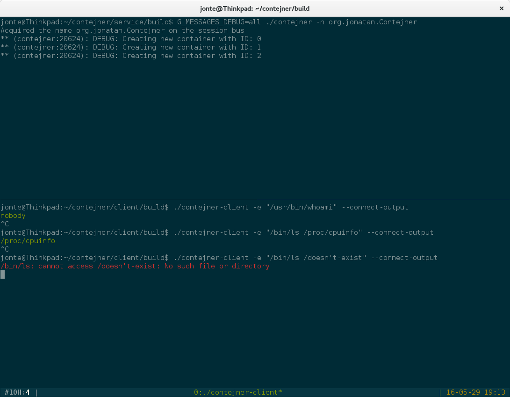

Contejner
=========

This is an attempt to put an easy-to-use D-Bus interface on top of Linux namespaces and cgroups ("containers").

How does it look?
=================

What works
==========
Service
-------------
* Expose manager interface for creating containers
* Export containers as objects on the ObjectManager interface defined by freedesktop
* Run applications with a pre-defined set of namespaces unshared

Client
------------
* Start & configure containers
* Receive container stdin & stderr as file descriptors over D-Bus
* Colorize stdout & stderr output

To-do
=====
* Utilize D-Bus properties more for Container objects and remove explicit set/get functions
* Add property for namespaces to unshare
* Add chroot path property
* Add function to bind mount directories under chroot
* Add function to stop container (kill child)
* Add function to destroy container (stop, free resources, remove from ObjectManager)

Known issues
============
* There is a race condition in the client between the "idle function" for reading stdout/stderr and the dbus exit signal handler - this means that sometimes the client will exit before producing output.
